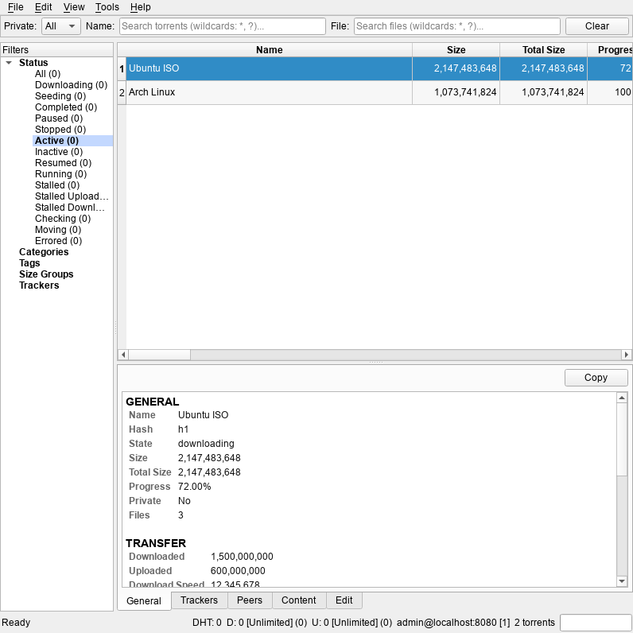
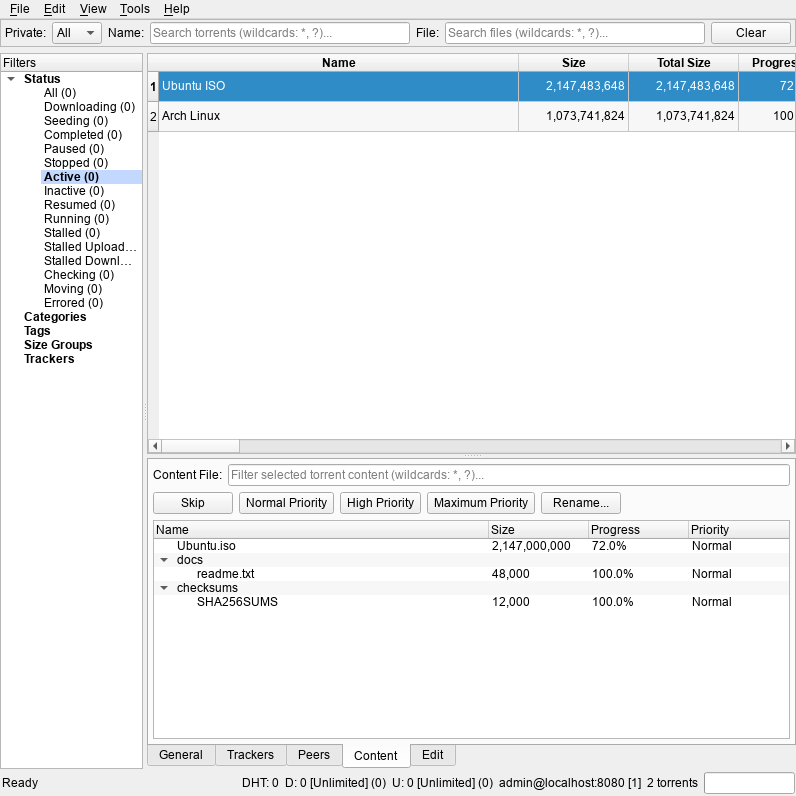
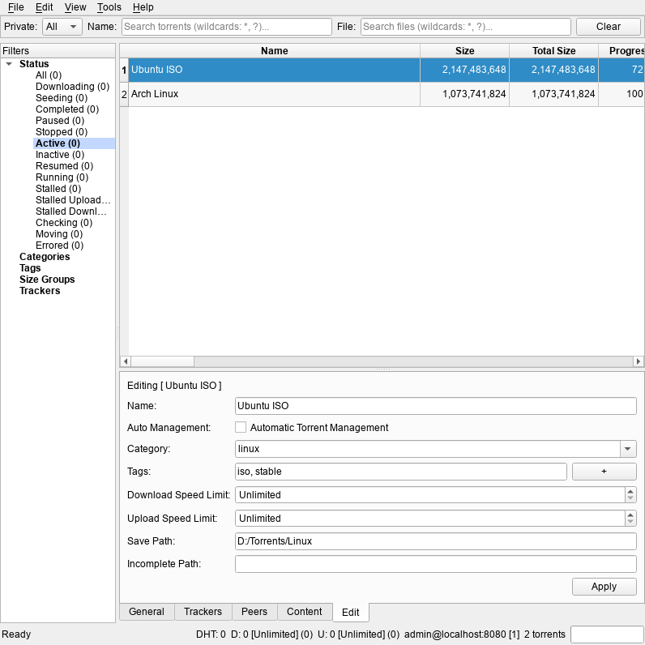

# qBiremo Enhanced - Advanced qBittorrent GUI Client

A feature-rich PySide6 desktop client for remote qBittorrent management.

It combines:
- high-density torrent views,
- cancellable background API tasks,
- remote + local filter layering,
- deep details/edit panels,
- and operational tooling (taxonomy management, speed profile management, tracker analytics, session timeline, clipboard ingest, and export).

## Table of Contents

- [Features](#features)
- [UI Walkthrough](#ui-walkthrough)
- [Requirements](#requirements)
- [Installation](#installation)
- [Usage](#usage)
- [Configuration](#configuration)
- [Keyboard Shortcuts](#keyboard-shortcuts)
- [Menu Reference](#menu-reference)
- [Project Structure](#project-structure)
- [Architecture](#architecture)
- [Development](#development)
- [Troubleshooting](#troubleshooting)
- [Legal Disclaimer](#legal-disclaimer)

## Features

### Main Workspace
- Unified main window with split layout:
  - top quick filter bar,
  - left filter tree,
  - torrent table,
  - bottom details tabs.
- Startup always opens maximized.
- Status bar with:
  - status text (left, stretches),
  - DHT nodes + download/upload transfer summary (speed, global limit, session totals),
  - instance identity (`user@host:port [instance_counter]`),
  - live torrent count,
  - indeterminate progress indicator while background work runs (always visible at far right).
- Window title shows aggregate download/upload speeds using configurable format tokens:
  - `{down_text}`
  - `{up_text}`

### Torrent Table and Views
- Extended torrent column model mapped to qBittorrent WebUI fields.
- Built-in presets:
  - `Basic View`
  - `Medium View` (default)
- Per-column visibility toggles from `View -> Torrent Columns`.
- Save current visible-columns + widths as named views.
- Re-apply saved named views from menu.
- Fit visible columns to content (`View -> Fit Columns`).
- Multi-select enabled for bulk actions.
- Numeric-aware sorting for numeric columns (sizes, speeds, dates, ratios, counts, progress sort by value, not text; booleans sort as `1.0`/`0.0`/`-1.0`).
- Torrent-list sort shortcuts for quick ordering by ratio/uploaded/progress/eta/name/status/size/date columns.
- After refresh, the previously selected torrent is restored by hash when still present.
- Enter/Return on selected torrent opens local torrent directory when path is available.
- Double-click row also opens local torrent directory.

### Filtering
- Quick filters (apply immediately):
  - Private: `All | Yes | No`
  - Name wildcard filter (`*`, `?`, implicit contains — typing `foo` matches `*foo*`)
  - File wildcard filter against cached file paths (same wildcard syntax)
  - Clear button resets all quick filters at once.
- Left filter tree sections:
  - Status
  - Categories
  - Tags
  - Size Groups (dynamic buckets)
  - Trackers
- Each section has an `All` entry at the top to deselect that dimension.
- Active filters are visually highlighted (bold + colored background) in the tree.
- Status/category/tag changes trigger fresh API fetches (remote filters).
- Size/tracker/name/file/private filters apply locally on loaded data (local filters).
- When using incremental sync (no remote filters), status filtering is approximated locally by mapping torrent state strings (`stalleddl`, `stalledup`, `checkingdl`, `metadl`, etc.) and progress/speed values.
- File filter uses persistent content cache and updates automatically when cache refresh completes.

### Data Fetch Model
- Uses incremental `/sync/maindata` flow when no remote filters are selected.
- Automatically switches to `torrents_info(...)` when remote filters are selected:
  - `status_filter`
  - `category`
  - `tag`
  - `private`
- Maintains and merges `rid` state for incremental sync updates.
- Tracks and updates alt-speed-mode state from transfer API.
- Auto-refresh default interval is `30s`.
- Auto-refresh interval can be increased automatically after slow refresh cycles (API task or UI render cycle), capped at `600s`.

### Details Area (Tabs)
- `General` tab:
  - grouped rich text sections (`GENERAL`, `TRANSFER`, `PEERS`, `METADATA`).
  - one-click copy-to-clipboard.
- `Trackers` tab:
  - full per-torrent tracker rows with sortable dynamic columns.
- `Peers` tab:
  - full per-torrent peers rows with sortable dynamic columns.
  - context menu actions:
    - copy all peers info (TSV),
    - copy selected peer info (TSV),
    - copy selected peer `IP:port`,
    - ban selected peer.
- `Content` tab:
  - cached file/folder tree with size/progress/priority columns.
  - real-time wildcard content filter for the selected torrent (`*`, `?` wildcards, matches against filename and full path).
  - inline content action buttons: `Skip`, `Normal Priority`, `High Priority`, `Maximum Priority`, `Rename...`.
  - content tree auto-refreshes when the cache for the selected torrent is updated.
  - Enter/Return and item activation open local file/folder if it exists.
- `Edit` tab (single-selected torrent only):
  - editable fields:
    - name,
    - auto management (tri-state: checked = enable, unchecked = disable, partial = leave unchanged),
    - category,
    - tags,
    - download/upload limits,
    - save path,
    - incomplete/download path.
  - sends only changed fields to API.
  - tag picker dialog (`+` button) with multi-select list of all known tags, pre-selecting currently assigned tags.
  - local-path browse buttons shown only when target paths exist locally.
  - on multi-selection, details area is disabled and replaced with informative placeholders.

### Torrent and Session Actions
- File menu:
  - Add torrent dialog.
  - Export selected torrents to `.torrent` files (filenames are sanitized; collisions resolved with hash suffix and counter).
- Edit menu torrent actions:
  - Start
  - Stop
  - Force Start
  - Recheck
  - Increase/Decrease/Top/Minimum queue priority
  - Remove
  - Remove and Delete Data
- Session-wide actions:
  - Pause Session
  - Resume Session

### Add Torrent Dialog
- Source supports:
  - local `.torrent` files (multiple, one per line, with multi-file browse),
  - magnet URLs (multiple, one per line),
  - HTTP/HTTPS URLs (multiple, one per line),
  - separate inputs for file sources vs magnet/URL sources.
- Basic options:
  - save path,
  - optional download path + `Use Download Path`,
  - category,
  - existing tags + extra tags,
  - rename,
  - cookie.
- Behavior options:
  - paused/stopped,
  - force start,
  - add to top,
  - skip checking,
  - sequential,
  - first/last piece priority,
  - auto torrent management,
  - root folder,
  - content layout,
  - stop condition.
- Limits/options:
  - upload/download limits,
  - ratio limit,
  - seeding time limit,
  - inactive seeding limit,
  - share-limit action.

### Tools Menu
- Clipboard monitor (toggle):
  - detects magnet links or raw BTIH hashes (40-char hex, 64-char hex, or 32-char base32) copied to clipboard,
  - automatically converts hashes to magnet URIs,
  - auto-queues add-torrent task,
  - deduplicates the last 256 seen payloads to prevent duplicate additions.
- Debug logging toggle:
  - logs API calls, responses, errors with timing.
- Edit `.ini` settings file (opens current QSettings INI path).
- Open Web UI in Browser:
  - launches the current qBittorrent Web UI URL in the default browser (`<scheme>://<user>@<host>:<port>`).
- Edit App Preferences dialog:
  - full preference tree editor with type-aware parsing,
  - changed-value highlighting,
  - apply only changed values.
- Edit Add Preferences (friendly) dialog:
  - simplified editor for common settings (downloads, queueing, connections, network/privacy, default seeding limits),
  - excludes speed limits (managed separately),
  - applies only changed values.
- Manage Speed Limits dialog:
  - view/edit normal + alternative global limits,
  - toggle alt speed mode.
- Manage Tags and Categories dialog:
  - create/edit/delete categories,
  - optional incomplete path support,
  - create/delete tags.
- Tracker Health Dashboard:
  - aggregates trackers across current torrents,
  - shows fail/working counts, fail rate, dead marker, avg next announce, last error,
  - a tracker is marked "dead" when it has failures but zero working reports and a fail rate >= 50%.
- Session Timeline:
  - stores up to 720 rolling samples (timestamp, DL/UL speeds, active count, alt-mode state),
  - graph for DL/UL/active torrents,
  - visual alt-mode background bands,
  - refresh and clear history controls.

## UI Walkthrough

1. Review session health and torrent activity at a glance.

   

   Overview of torrent table, status filters, and live transfer context.

2. Inspect content/details workflow for a selected torrent.

   

   Workflow state showing content cache and detailed transfer metadata.

3. Execute edit and action controls from detail tabs.

   

   Action-focused detail tab state for updating torrent settings safely.

## Requirements

- **Windows** (10 or later)
- **Python 3.13+**
- **qBittorrent** instance with WebUI API access

Runtime dependencies: `PySide6 >=6.10.2`, `qbittorrent-api >=2025.11.1`.

## Installation

### First-time Setup

```bat
python scripts\windows\setup_env.py
```

Creates the `.venv` by running `uv sync --locked` (falls back to `uv sync` if no lockfile).

Manual alternative for development:

```bat
uv sync --group dev
```

## Usage

### Recommended (console-less)

```bat
pyw scripts\windows\run_app_gui.pyw
```

Launches the GUI without a console window. Auto-bootstraps the `.venv` via `setup_env.py` if not yet created.

### With console

```bat
python scripts\windows\run_app.py
```

Runs via `hatch run python -m qbiremo_enhanced`. Requires `hatch` in PATH.

### Direct

```bat
python -m qbiremo_enhanced
```

### Command-line Options

```text
-p, --profile        Runtime profile id (default: default)
--instance_counter   Positive per-server instance counter suffix (default: 1)
--config-dir         Override QSettings INI root (takes precedence over CONFIG_DIR)
--data-dir           Override runtime data root (takes precedence over DATA_DIR)
-h, --help           Show help
```

### Quick Start

1. Launch the app using one of the methods above
2. On first launch, configure your qBittorrent host, port, and credentials
3. The main window opens maximized with the torrent table and filter tree

## Configuration

Runtime config uses QSettings profile storage:

- Store backend: `QSettings(IniFormat, UserScope, "ThreepSoftwz", "qbiremo_enhanced")`
- Default INI path: `%APPDATA%\ThreepSoftwz\qbiremo_enhanced.ini`
- OV01 overrides:
  - `CONFIG_DIR` env var or `--config-dir`
  - `DATA_DIR` env var or `--data-dir`
- Profiles are stored under `profiles/<profile_id>/...`
- Startup profile is selected with `--profile` (default: `default`)
- Env secret overrides remain supported:
  - `QBIREMO_PASSWORD`
  - `QBIREMO_HTTP_BASIC_AUTH_PASSWORD`

### Key Settings

Validated key contract (`validate_and_normalize_config`):

| Key | Type | Default if Missing/Invalid | Allowed Values / Validation Rules |
|---|---|---|---|
| `qb_host` | `str` | `"localhost"` | Non-empty string. Can be hostname/IP or full URL (`http[s]://host[:port][/path]`). If URL includes `user:pass@`, those are used for HTTP basic auth. |
| `qb_port` | `int` | `8080` | Must be in range `1..65535`. |
| `qb_username` | `str` | `"admin"` | qBittorrent API username (not reverse-proxy basic auth). |
| `qb_password` | `str` | `""` | qBittorrent API password. |
| `http_basic_auth_username` | `str` | `""` | Optional reverse-proxy basic-auth username. If `qb_host` has embedded username, embedded value wins. |
| `http_basic_auth_password` | `str` | `""` | Optional reverse-proxy basic-auth password. If `qb_host` has embedded password, embedded value wins. |
| `http_protocol_scheme` | `str` | Effective default: `"http"` | Allowed: `"http"`, `"https"`. Invalid value is normalized to `"http"`. |
| `http_timeout` | `int` | `300` | Must be integer `> 0`. Used as qBittorrent API HTTP timeout in seconds. |
| `log_file` | `str` | `"qbiremo_enhanced.log"` | Non-empty path string. Relative paths are resolved under `%LOCALAPPDATA%\\ThreepSoftwz\\qbiremo_enhanced\\logs\\` (or `DATA_DIR\\qbiremo_enhanced\\logs\\` when overridden). |
| `title_bar_speed_format` | `str` | `"[D: {down_text}, U: {up_text}]"` | Must be non-empty and format successfully with `{down_text}` and `{up_text}` placeholders. |

### Behavior Notes

- Unknown profile keys are ignored with warnings.
- If `qb_host` includes a full URL with embedded userinfo, HTTP basic auth is extracted and sent via `Authorization` header.
- Environment fallback for HTTP basic auth:
  - `X_HTTP_USER`
  - `X_HTTP_PASS`
- Internal keys are runtime-managed and should not be set manually:
  - `_profile_id`, `_log_file_path`, `_instance_id`, `_instance_counter`, `_instance_lock_file_path`

### Caching, Persistence, and Instance Isolation

- Persistent content cache stored as JSON.
- Cache path defaults to `%LOCALAPPDATA%\ThreepSoftwz\qbiremo_enhanced\`.
- Cache filename is instance-scoped using deterministic host+port hash suffix.
- Cache older than 3 days is deleted on startup.
- `Clear Cache & Refresh` removes cache file and refreshes list.
- QSettings storage is forced to INI backend.
- Settings are instance-scoped by host+port-derived app name suffix.
- Persisted runtime settings include:
  - geometry/state,
  - splitters,
  - table header state,
  - hidden columns,
  - status filter,
  - auto-refresh settings,
  - display mode,
  - clipboard monitor toggle,
  - debug logging toggle,
  - named column views.

## Keyboard Shortcuts

Torrent-table sort shortcuts apply when the torrent list has focus.

| Shortcut | Action |
|---|---|
| `Ctrl+O` | Add Torrent |
| `Ctrl+Shift+N` | New instance (current config) |
| `Ctrl+Q` / `Alt+X` | Exit |
| `F1` | Help |
| `F5` | Refresh |
| `Ctrl+F5` | Clear Cache & Refresh (global view action) |
| `F6` | Show active torrents |
| `F7` | Show complete torrents |
| `F8` | Show all torrents |
| `Ctrl+F1` | Sort torrents by ratio |
| `Ctrl+Alt+F1` | Sort torrents by uploaded |
| `Ctrl+F2` | Sort torrents by progress |
| `Ctrl+Alt+F2` | Sort torrents by ETA |
| `Ctrl+F3` | Sort torrents by name |
| `Ctrl+Alt+F3` | Sort torrents by status |
| `Ctrl+F5` | Sort torrents by total size (torrent list focus) |
| `Ctrl+Alt+F5` | Sort torrents by size |
| `Ctrl+F6` | Sort torrents by added date |
| `Ctrl+Alt+F6` | Sort torrents by complete date |
| `Ctrl+S` | Start selected |
| `Ctrl+P` | Stop selected |
| `Ctrl+M` | Force Start selected |
| `Ctrl+R` | Recheck selected |
| `Ctrl++` / `Ctrl+-` | Queue priority up / down |
| `Ctrl+Shift++` / `Ctrl+Shift+-` | Queue priority top / minimum |
| `Del` | Remove selected |
| `Shift+Del` | Remove + Delete Data |
| `Ctrl+Del` | Remove selected (no confirmation) |
| `Ctrl+Shift+Del` | Remove + Delete Data (no confirmation) |
| `Ctrl+Shift+P` | Pause Session (all) |
| `Ctrl+Shift+S` | Resume Session (all) |
| `Enter` / `Return` | Open local torrent directory / content file |

## Menu Reference

### File
- `Add Torrent...` (`Ctrl+O`)
- `Export Torrent...`
- `New instance` (`Ctrl+Shift+N`) - launch another app instance with current config
- `New instance from profile...` - choose a profile id and launch a new instance
- `New profile...` - create a new profile from current config and launch a new instance with it
- `Exit` (`Ctrl+Q`, `Alt+X`)

### Edit
- `Start` (`Ctrl+S`)
- `Stop` (`Ctrl+P`)
- `Force Start` (`Ctrl+M`)
- `Recheck` (`Ctrl+R`)
- `Increase Priority in Queue` (`Ctrl++`)
- `Decrease Priority in Queue` (`Ctrl+-`)
- `Top Priority in Queue` (`Ctrl+Shift++`)
- `Minimum Priority in Queue` (`Ctrl+Shift+-`)
- `Remove` (`Del`)
- `Remove and Delete Data` (`Shift+Del`)
- `Remove (no confirmation)` (`Ctrl+Del`)
- `Remove and Delete Data (no confirmation)` (`Ctrl+Shift+Del`)
- `Pause Session` (`Ctrl+Shift+P`)
- `Resume Session` (`Ctrl+Shift+S`)

### View
- `Open Log File`
- `Refresh` (`F5`)
- `Clear Cache & Refresh` (`Ctrl+F5`)
- `Show Active Torrents` (`F6`)
- `Show Complete Torrents` (`F7`)
- `Show All Torrents` (`F8`)
- `Human Readable` (toggle)
- `Torrent Columns` submenu (presets + per-column toggles + named views)
- `Fit Columns`
- `Enable Auto-Refresh (<seconds>)` (toggle)
- `Set Auto-Refresh Interval...`
- `Reset View`

### Tools
- `Enable Clipboard Monitor` (toggle)
- `Enable Debug Logging` (toggle)
- `Edit .ini File`
- `Open Web UI in Browser`
- `Edit App Preferences`
- `Edit Add Preferences (Friendly)`
- `Manage Speed Limits...`
- `Manage Tags and Categories`
- `Tracker Health Dashboard...`
- `Session Timeline...`

### Help
- `Help` (`F1`)

## Project Structure

```text
qbiremo-enhanced/
|-- pyproject.toml
|-- uv.lock
|-- src/
|   `-- qbiremo_enhanced/
|       |-- __init__.py
|       |-- __main__.py
|       |-- main_window.py
|       |-- qbiremo_enhanced.ico
|       |-- controllers/
|       |   |-- __init__.py
|       |   |-- base.py
|       |   |-- network_api.py
|       |   |-- filter_table.py
|       |   |-- details_content.py
|       |   |-- actions_taxonomy.py
|       |   `-- session_ui.py
|       |-- dialogs.py
|       |-- tasking.py
|       |-- config_runtime.py
|       |-- utils.py
|       |-- types.py
|       |-- constants.py
|       `-- py.typed
|-- scripts/
|   |-- policy/
|   |   `-- check_standard.py
|   `-- windows/
|       |-- setup_env.py                 # Create/verify .venv via uv sync
|       |-- run_app.py                   # Launch app via hatch run
|       |-- run_app_gui.pyw              # Launch GUI without console window
|       |-- run_tests.py                 # Run tests via hatch run test
|-- docs/
|   `-- architecture/
|       `-- MEMORY_SPEC.md               # Architecture reference spec
|-- tests/
|   |-- conftest.py                      # Shared fixtures and mocks
|   |-- unit/
|   |-- integration/
|   `-- gui/
`-- README.md
```

## Architecture

- Package-based architecture with purpose-specific modules under `src/qbiremo_enhanced/`.
- `MainWindow` is the composition root and delegates domain behavior to feature controllers.
- Background API operations run through cancellable worker tasks (`APITaskQueue` using `QRunnable` + `QThreadPool`). Each new task cancels the currently running worker in that queue — latest task wins (not a FIFO queue).
- Three independent queue instances reduce contention:
  - `api_queue` — general operations (refresh, mutations, dialogs).
  - `details_api_queue` — selected-torrent trackers/peers loading.
  - `analytics_api_queue` — tracker health dashboard loading.
- Remote filtering is used when possible to reduce payload size; local post-filtering handles quick text/file/size/tracker filters.
- Content filter accuracy depends on cached `torrents_files` snapshots.
- When debug logging is enabled, the API client is wrapped with a transparent proxy (`_DebugAPIClientProxy`) that logs call names, args, responses, exceptions, and elapsed time.
- Display modes: sizes and speeds can be shown as raw bytes (with thousands separators) or human-readable units (KB/MB/GB/TB), toggled via `View -> Human Readable`.

### Instance Isolation and Locking

Every qBittorrent server connection is fully isolated:

- A deterministic 8-character hex hash is computed from `host:port`.
- The `instance_counter` (default `1`) is appended to create the final instance ID.
- Each instance gets its own:
  - QSettings INI file (`qbiremo_enhanced_<id>`),
  - content cache file (JSON, under app data root),
  - log file (instance-suffixed filename),
  - OS-level lock file (`.lck`).
- On startup, the app acquires an exclusive byte-range lock on the `.lck` file. If the lock is already held (another instance is running with the same counter), the counter auto-increments until a free slot is found.
- Lock files are released and cleaned up on normal exit via `atexit`.

### Logging and Error Handling

- File-based logging only (no floating log panel in current build).
- Log file path can be configured and is instance-suffixed.
- Startup fatal exceptions are logged and the log file is opened automatically.
- Global exception hook logs unhandled exceptions and flushes file handler.
- Background task failures surface to status bar and log.

### API Documentation References

- [qBittorrent WebUI API: Get Torrent List (`/api/v2/torrents/info`)](https://github.com/qbittorrent/qBittorrent/wiki/WebUI-API-(qBittorrent-5.0)#get-torrent-list)
- [qbittorrent-api: `TorrentsAPIMixIn.torrents_info`](https://qbittorrent-api.readthedocs.io/en/latest/apidoc/torrents.html#qbittorrentapi.torrents.TorrentsAPIMixIn.torrents_info)
- [qbittorrent-api: Client API](https://qbittorrent-api.readthedocs.io/en/latest/apidoc/client.html)

## Development

### Windows Helpers

| Script | Description |
|---|---|
| `python scripts\windows\setup_env.py` | Create/verify `.venv` via `uv sync --locked` |
| `pyw scripts\windows\run_app_gui.pyw` | Launch GUI without console window (auto-bootstraps venv) |
| `python scripts\windows\run_app.py` | Launch app via `hatch run` (requires hatch in PATH) |
| `python scripts\windows\run_tests.py` | Run test suite via `hatch run test` |

### Testing

```bat
hatch run test
```

### Quality Checks

Run all standard sessions via Hatch:

```bat
hatch run lint:all
hatch run test-cov
```

Individual checks:

```bat
hatch run lint:check
hatch run lint:fmt
hatch run lint:types
hatch run lint:policy
```

Run Pyright as a non-blocking canary check:

```bat
hatch run lint:types
```

### Quality Policy

- `basedpyright` is the authoritative type-check gate in CI.
- `ruff format` is mandatory and enforced in CI and pre-commit.

### Pre-commit Setup

```bat
pre-commit install
pre-commit install --hook-type pre-push
```

Local hook stages:
- `pre-commit`: `check-merge-conflict`, `end-of-file-fixer`, `trailing-whitespace`, `check-added-large-files`, `ruff`, `ruff-format`
- `pre-push`: `basedpyright`, `pytest` (with coverage)

Current tests cover:
- filters and cache behavior,
- menu wiring and shortcuts,
- table/view persistence,
- add-torrent payload construction,
- config validation and startup failure behavior,
- details/content actions,
- taxonomy/speed/preferences/analytics dialogs.

### Lockfile Workflow

```bat
uv lock
uv lock --check
```

## Troubleshooting

### qBittorrent connection errors

- Verify the WebUI is enabled in qBittorrent (Tools > Options > Web UI)
- Verify host, port, username, and password are correct
- Check that the qBittorrent API is reachable from this machine
- If behind a reverse proxy, configure `http_basic_auth_username` and `http_basic_auth_password`

### Instance lock conflicts

- If the app fails to start with a lock error, another instance may be running with the same profile and counter
- Use `--instance_counter 2` (or higher) to run a second instance against the same server
- Lock files are in `%LOCALAPPDATA%\ThreepSoftwz\qbiremo_enhanced\` by default (or under `DATA_DIR`) and are cleaned up on normal exit

### Config issues

- Use *Tools > Edit .ini File* to manually inspect and edit the config
- Unknown keys are silently ignored; check log file for validation warnings
- To reset, delete the QSettings INI file and restart

## Credits

Built with:
- PySide6
- qbittorrent-api
- Python

Original qBiremo concept extended with:
- advanced filtering,
- robust table/view management,
- taxonomy/speed/preferences tooling,
- tracker and timeline analytics,
- stronger persistence and debugging workflow.

---

<!-- legal-disclaimer:start -->
## Legal Disclaimer

THIS SOFTWARE IS PROVIDED "AS IS" AND "AS AVAILABLE," WITHOUT WARRANTIES OF ANY KIND, WHETHER EXPRESS, IMPLIED, STATUTORY, OR OTHERWISE, INCLUDING, WITHOUT LIMITATION, ANY IMPLIED WARRANTIES OF MERCHANTABILITY, FITNESS FOR A PARTICULAR PURPOSE, TITLE, NON-INFRINGEMENT, ACCURACY, OR QUIET ENJOYMENT. TO THE MAXIMUM EXTENT PERMITTED BY APPLICABLE LAW, THE AUTHORS, CONTRIBUTORS, MAINTAINERS, DISTRIBUTORS, AND AFFILIATED PARTIES SHALL NOT BE LIABLE FOR ANY DIRECT, INDIRECT, INCIDENTAL, SPECIAL, CONSEQUENTIAL, EXEMPLARY, OR PUNITIVE DAMAGES, OR FOR ANY LOSS OF DATA, PROFITS, GOODWILL, BUSINESS OPPORTUNITY, OR SERVICE INTERRUPTION, ARISING OUT OF OR RELATING TO THE USE OF, OR INABILITY TO USE, THIS SOFTWARE, EVEN IF ADVISED OF THE POSSIBILITY OF SUCH DAMAGES. THIS SOFTWARE HAS BEEN DEVELOPED, IN WHOLE OR IN PART, BY "INTELLIGENT TOOLS"; ACCORDINGLY, OUTPUTS MAY CONTAIN ERRORS OR OMISSIONS, AND YOU ASSUME FULL RESPONSIBILITY FOR INDEPENDENT VALIDATION, TESTING, LEGAL COMPLIANCE, AND SAFE OPERATION PRIOR TO ANY RELIANCE OR DEPLOYMENT.
<!-- legal-disclaimer:end -->
