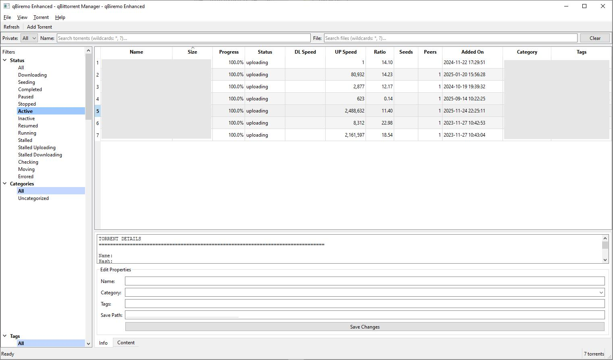

# qBiremo Enhanced - Advanced qBittorrent GUI Client

A feature-rich PySide6-based GUI application for managing qBittorrent remotely with advanced filtering, queued API operations, and comprehensive logging.



## Features

### Core Functionality
- **Clean Modern UI** with tree-view filters and grid-based torrent display
- **Queued API Operations** - All API calls are executed sequentially, preventing race conditions
- **Comprehensive Logging** - Floating log panel with execution times and error tracking
- **Auto-Refresh** - Configurable automatic refresh with enable/disable toggle
- **Add Torrent Dialog** - Full-featured dialog for adding torrents with all parameters
- **Progress Tracking** - Status bar shows current operation progress

### Advanced Filtering
Filter torrents by multiple criteria:
- **Status**: All standard qBittorrent states (downloading, seeding, completed, paused, etc.)
- **Category**: Filter by torrent category
- **Tags**: Filter by torrent tags
- **Size Groups**: Dynamic size buckets based on torrent collection
- **Trackers**: Filter by tracker domain
- **Private/Public**: Filter by private flag
- **Name Matching**: DOS-style wildcards (*, ?)
- **File Content**: Search within torrent files (wildcards supported)

### UI Components
- **Menu Bar**: File, View, Torrent, and Help menus
- **Toolbar**: Quick access to common actions
- **Filter Bar**: Text-based filters for name and file content
- **Left Panel**: Tree-view filters for status, category, tags, size, and trackers
- **Torrents Grid**: Sortable table with all torrent information
- **Details Panel**: Comprehensive information about selected torrent
- **Status Bar**: Shows operation status, progress, and torrent count
- **Log Panel**: Floating window with detailed operation logs

## Installation

### Requirements
```bash
pip install PySide6 qbittorrent-api --break-system-packages
```

### Optional: Virtual Environment
```bash
python -m venv venv
source venv/bin/activate  # Linux/Mac
# or
venv\Scripts\activate  # Windows

pip install PySide6 qbittorrent-api
```

## Configuration

### Configuration File
Edit `qbiremo_enhanced_config.toml`:
```toml
qb_host = "localhost"
qb_port = 8080
qb_username = "admin"
qb_password = "your_password"

# Optional HTTP Basic Auth (reverse proxy layer)
http_basic_auth_username = ""
http_basic_auth_password = ""

auto_refresh = false
refresh_interval = 60
```

## Usage

### Basic Usage
```bash
python qbiremo_enhanced.py
```

### With Custom Config
```bash
python qbiremo_enhanced.py -c /path/to/config.toml
```

### Command Line Options
```
-c, --config-file    Path to configuration file (default: qbiremo_enhanced_config.toml)
-h, --help          Show help message
```

## Features Guide

### Filtering Torrents

#### Status Filters
Click any status in the left panel:
- All, Downloading, Seeding, Completed, Paused, Stopped
- Active, Inactive, Resumed, Running, Stalled
- Stalled Uploading, Stalled Downloading
- Checking, Moving, Errored

#### Text Filters
Use wildcards in the filter bar:
- `*.mkv` - All MKV files
- `ubuntu*` - Starts with "ubuntu"
- `*2024*` - Contains "2024"
- `video?` - "video" followed by any single character

#### Combining Filters
Filters are cumulative:
1. Select status from tree
2. Select category from tree
3. Add name pattern
4. Apply file content filter
5. Click "Apply Filters"

### Adding Torrents

1. **Menu**: File → Add Torrent or click toolbar button
2. **Source**: Choose torrent file or enter magnet link
3. **Configure**:
   - Save path
   - Category (select or create new)
   - Tags (comma-separated)
   - Auto TMM, Paused, Sequential, etc.
   - Ratio and seeding time limits
4. **Click OK** to add

### Log Panel

**View**: View → Show Log Panel

Features:
- **Stay on Top**: Keep log visible over other windows
- **Detailed Logs**: Timestamp, level, message, execution time
- **Error Tracking**: All errors logged with full details
- **Clear**: Remove all log entries

Logs show:
- API operation start/completion
- Execution times for performance monitoring
- Filter changes
- Errors with full stack traces

### Auto-Refresh

**Toggle**: View → Enable Auto-Refresh

- Default interval: 60 seconds (configurable)
- Respects current filters
- Optimized API calls (passes filters to backend)
- Can be disabled for manual control

### Torrent Details

Click any torrent to see:
- Transfer statistics
- Peer information
- Metadata (category, tags, dates)
- File paths

## Error Handling

All errors are handled gracefully:
- **No Message Boxes** - Errors shown in status bar and log
- **Queue Cleared** - On failure, pending operations are cancelled
- **Connection Errors** - Logged with full details
- **API Failures** - Retry by refreshing

## Keyboard Shortcuts

- `Ctrl+O` - Add Torrent
- `Ctrl+Q` - Exit
- Click column headers to sort

## Architecture

### API Task Queue
- Single-threaded queue ensures sequential execution
- Prevents API overload and race conditions
- Each task logs start time and duration
- Automatic queue clearing on errors

### Worker Threads
- Background operations don't block UI
- Progress signals for status updates
- Error signals for exception handling
- Result signals for data delivery

### Filter Optimization
- Status and category filters passed to API
- Reduces data transfer and processing
- Local filters applied after API fetch
- Size buckets calculated dynamically

## Performance Notes

- **File Content Filter**: Expensive operation (requires per-torrent API call)
- **Tracker Extraction**: One-time operation on data load
- **Size Buckets**: Recalculated when torrents change
- **Auto-Refresh**: Uses optimized API calls with filters

## Troubleshooting

### Connection Failed
1. Check qBittorrent is running
2. Verify WebUI is enabled in qBittorrent settings
3. Confirm host/port/credentials
4. Check firewall settings

### Slow Performance
1. Disable file content filter
2. Reduce refresh interval
3. Apply status/category filters to reduce dataset
4. Check network latency

### UI Not Updating
1. Check log panel for errors
2. Manually refresh (toolbar button)
3. Clear and reapply filters
4. Restart application

## Development

### Code Structure
```
qbiremo_enhanced.py
├── Worker/Signal Classes    # Threading infrastructure
├── APITaskQueue             # Sequential API execution
├── LogPanel                 # Floating log window
├── AddTorrentDialog         # Add torrent UI
├── Utility Functions        # Formatting, filtering
└── MainWindow               # Main application
    ├── UI Creation
    ├── Filter Management
    ├── API Operations
    ├── Table Updates
    └── Event Handlers
```

### Adding Features
1. Create async fetch function
2. Create callback function
3. Queue task via `api_queue.add_task()`
4. Update UI in callback
5. Log operation with timing

## License

Open source - modify and distribute freely.

## Credits

Built with:
- PySide6 (Qt for Python)
- qbittorrent-api
- Python 3.10+

Original qBiremo concept enhanced with:
- Advanced filtering
- Queued API operations
- Comprehensive logging
- Add torrent functionality
